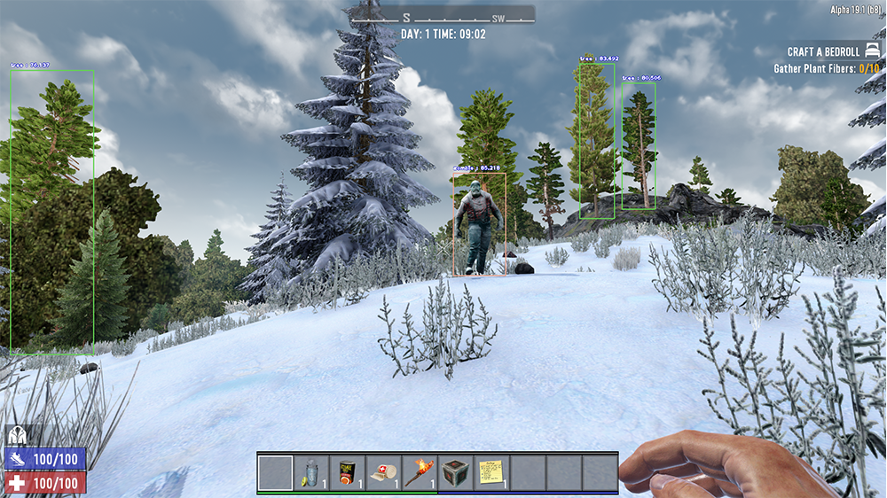
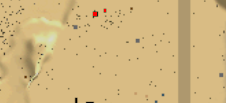

# py7dtd - A 7 Days to Die tools collection


<https://7daystodie.com/>

In this repository are collected tools and scripts for the game 7 Days to Die:

- Tools for the detection of objects/entities
- Scripts for the automatization of actions (mining, crafting, etc.)
- Aim bots
- Passcode cracking
- Block detection

## Installing

This software can be installed as a `pip` module.

### Windows

```powershell
py -m pip install py7dtd
```

### Unix

```bash
python -m pip install py7dtd
```

### Usage

There are currently three functions available:

- [Auto shooting](#aim-bot)
- [Crack passcode](#passcode-cracking)
- [Blocks detection](#blocks-detection)

---

## Contributing

Clone the module, create a virtual environment and install it:

```powershell
git clone --recurse-submodules git@github.com:tassoneroberto/py7dtd.git
cd py7dtd
py -3.10 -m venv venv
.\venv\Scripts\Activate.ps1
py -m pip install .\iocontroller
py -m pip install .[ai]
ltt install torch torchvision
```

Note: if you are not interested in "entities detection" or "aimbot" then you can omit `[ai]` from the above command and the `ltt install torch torchvision` command:

```powershell
py -m pip install .\iocontroller
py -m pip install .
```

### Development mode

To install the package in edit mode (for developers) specify `-e`:

```powershell
py -m pip install -e .\iocontroller
py -m pip install -e .[ai]
ltt install torch torchvision
```

### Dependencies for entities detection

Disclaimer: an NVIDIA® GPU card with CUDA® architectures 3.5, 3.7, 5.2, 6.0, 6.1, 7.0 or higher is required. See the list of CUDA®-enabled GPU cards (<https://developer.nvidia.com/cuda-gpus>).

Install the following dependencies:

- C++ redistributable (<https://support.microsoft.com/en-us/help/2977003/the-latest-supported-visual-c-downloads>)
- NVIDIA® GPU drivers —CUDA® 11.2.1 (<https://www.nvidia.com/drivers>)
- CUDA® Toolkit 11.1 (<https://developer.nvidia.com/cuda-toolkit-archive>)
- cuDNN SDK 7.6 (<https://developer.nvidia.com/cudnn>)

In order to use the module you need a `x64` version of `Python 3.10.x`.
You can download it at this page: <https://www.python.org/downloads/windows/>

You also need to have a trained model for the entities detection in `./dataset/models/` and the dataset config json to in `./dataset/json/`.
You can train it yourself by following the instructions below or you can download it here:

- <https://github.com/tassoneroberto/py7dtd/releases/download/v1.0.0-alpha1/yolov3_dataset_last.pt> (copy to `./dataset/models/`)
- <https://github.com/tassoneroberto/py7dtd/releases/download/v1.0.0-alpha1/dataset_yolov3_detection_config.json> (copy to `./dataset/json/`)

https://github.com/tassoneroberto/py7dtd/releases/download/v1.0.0-alpha1/dataset_yolov3_detection_config.json

### Training the entity detection model

The dataset used to train the model has to be increased to to improve the reliability of the detection. This can be done using the open source tool `labelImg` <https://github.com/tzutalin/labelImg>. The folder `dataset` needs to have the following structure:

- train
  - annotations
    - classes.txt
    - source1.txt
    - source2.txt
    - source3.txt
    - ...
  - images
    - source1.png
    - source2.png
    - source3.png
    - ...
- validation
  - annotations
    - classes.txt
    - source101.txt
    - source102.txt
    - source103.txt
    - ...
  - images
    - source101.png
    - source102.png
    - source103.png
    - ...

Run the following command to start training the model:

```powershell
py7dtd_model_training
```

The following table is listing all the arguments that can be specified:

| arg           |  description      |   default   |
|:-------------:|:-----------------:| :----------:|
| help          | Arguments description | `N/A`|
| dataset       | Dataset folder path | `./dataset`|
| pretrained    | Pre-trained model path | `./dataset/models/yolov3.pt`|
| epochs        | Number of epochs to train | `200` |

#### Notes

- The annotation has to be in the YOLO format.
- The test set has to be a lot smaller than the size of the train set.
- The `classes.txt` are automatically generated by `labelImg` and contain the names of the objects to detect.
- You can use a pre-trained model for transfer learning. To do so you have to download the file <https://github.com/tassoneroberto/py7dtd/releases/download/v1.0.0-alpha1/yolov3.pt> and put it in `./dataset/models` (or specify a different location with the argument `--pretrained`).

## Entities detection

❗ Under development ❗

Simple entities detector using AI (Computer Vision).

The objects detection (trees, zombies, etc.) is done using `ImageAI`: <https://github.com/OlafenwaMoses/ImageAI/>

The annotation of the images has been done using the tool `labelImg`: <https://github.com/heartexlabs/labelImg/>

### Proof of concept



---

## Aim bot

❗ Under development ❗

Simple aim bot capable of:

- Detect zombies/players
- Move the mouse to the target
- Shoot

### Usage

```powershell
py7dtd_auto_shooting --delay 200
```

Note: Press `ESC` to interrupt the bot.

### Command line arguments

The following table is listing all the arguments that can be specified:

| arg           |  description      |   default   |
|:-------------:|:-----------------:| :----------:|
| help          | Arguments description           | `N/A`|
| delay         | Time in ms between each screenshot | `500`|
| output         | Output folder | `./auto_shooting`|


---

## Passcode cracking

❗ Under development ❗

Bruteforce/dictionary attack on chests/doors passcode.

### Usage

It is recommended to set the game in window mode with a resolution of 640x480.

Example of a bruteforce attack testing passcodes composed of digits and lowercase characters.

Note: Press `ESC` to interrupt the bot.

```powershell
py7dtd_crack_passcode --brute --digits --lower
```

Get the arguments list with the `help` function:

```powershell
py7dtd_crack_passcode --help
```


Example of a dictionary attack with no limit in tries.

```powershell
py7dtd_crack_passcode --dict
```

Note: dictionaries can be found at <https://github.com/danielmiessler/SecLists/tree/master/Passwords>.


### Command line arguments

The available methods are **bruteforce attack** (`--brute`) and **dictionary attack** (`--dict`).

The following table is listing all the arguments to use for each method:

| arg           |  description      |   default   | type     |
|:-------------:|:-----------------:| :----------:|:--------:|
| help          | Arguments description           | `N/A`|`N/A`|
| min           | Minimum length                  | `1`|`brute`|
| max           | Maximum length                  | `20`|`brute`|
| digits        | Include digits                  | `False`*|`brute`|
| lower         | Include lowercase characters    | `False`*|`brute`|
| upper         | Include uppercase characters    | `False`*|`brute`|
| lowercyrillic | Include lowercase cyrillic characters    | `False`*|`brute`|
| uppercyrillic | Include uppercase cyrillic characters    | `False`*|`brute`|
| special       | Include special characters      | `False`*|`brute`|
| dictpath      | Dictionary file path            | `./dictionaries/top1000000.txt`|`dict`|
| resumedict    | Line number to resume a dictionary attack | `0`|`dict`|
| limit         | Maximum number of tries         | `∞`|`brute`, `dict`|
| timeout       | Maximum time in seconds allowed | `∞`|`brute`, `dict`|
| delay         | Delay in ms between each action | `35`|`brute`, `dict`|

---

**At least one of these is required*

## Blocks detection

❗ Under development ❗

Detection of block, like `topsoil` and `destroyed stone` blocks, by taking screenshots of the map.

### Usage

It is recommended to set the game in window mode with the highest resolution possible.

Specify the blocks to be identified by passing them as arguments (e.g. `--topsoil`). Specify an output folder (or keep the default one `./blocks_detection`). Run the script and open the game map by pressing `M`. Press `P` to take a screenshot of the map and automatically mark in red the specified blocks. The screenshots, with the block marked, will be saved in the output folder.

Note: Press `ESC` to interrupt the script.

```powershell
py7dtd_blocks_detection --topsoil --destroyed
```

Get the arguments list with the `help` function:

```powershell
py7dtd_blocks_detection --help
```

Example of detection of topsoil blocks in the desert biome:




### Command line arguments

The following table is listing all the arguments:

| arg           |  description              |   default   |
|:-------------:|:-------------------------:| :----------:|
| help          | Arguments description     | `N/A`        |
| topsoil       | Topsoil blocks            | `False`*   |
| destroyed     | Destroyed stone blocks    | `False`*   |
| output        | Output folder             | `./blocks_detection`|

**At least one of these is required*
