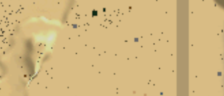

# py7dtd - A 7 Days to Die tools collection


<https://7daystodie.com/>

In this repository are collected tools and scripts for the game 7 Days to Die:

- Tools for the detection of objects/entities
- Scripts for the automatization of actions (mining, crafting, etc.)
- Aim bots
- Passcode cracking
- Block detection

## Installing

This software can be installed as a `pip` module.

### Windows

```powershell
py -m pip install py7dtd
```

### Unix

```bash
python -m pip install py7dtd
```

### Usage

There are currently three functions available:

- [Auto shooting](#aim-bot)
- [Crack passcode](#passcode-cracking)
- [Blocks detection](#blocks-detection)

---

## Contributing

Clone the module, create a virtual environment and install it:

```powershell
git clone git@github.com:tassoneroberto/py7dtd.git
cd py7dtd
py -3.7 -m venv venv
.\venv\Scripts\Activate.ps1
py -m pip install .[ai]
```

Note: if you are not interested in "entities detection" or "aimbot" then you can omit `[ai]` from the above command:

```powershell
py -m pip install .
```

### Dev mode

To install the package in edit mode (for developers) specify `-e`:

```powershell
py -m pip install -e .[ai]
```

### Dependencies for entities detection

Disclaimer: an NVIDIA® GPU card with CUDA® architectures 3.5, 3.7, 5.2, 6.0, 6.1, 7.0 or higher is required. See the list of CUDA®-enabled GPU cards (<https://developer.nvidia.com/cuda-gpus>).

Install the following dependencies:

- C++ redistributable (<https://support.microsoft.com/en-us/help/2977003/the-latest-supported-visual-c-downloads>)
- NVIDIA® GPU drivers —CUDA® 11.2.1 (<https://www.nvidia.com/drivers>)
- CUDA® Toolkit 11.1 (<https://developer.nvidia.com/cuda-toolkit-archive>)
- cuDNN SDK 7.6 (<https://developer.nvidia.com/cudnn>)

(More info here: <https://www.tensorflow.org/install/gpu>)

In order to use the module you need a `x64` version of `Python 3.7.x`.
You can download it at this page: <https://www.python.org/downloads/windows/>

Download link: <https://www.python.org/ftp/python/3.7.9/python-3.7.9-amd64.exe>

You also need to download the trained model (<https://github.com/tassoneroberto/py7dtd/releases/download/v0.2/model.h5>) for the entities detection and move it to `src/ai/models/v2/`.

### Optional

To be able to train a model you need to download the `ImageAI`'s pre-trained model (<https://github.com/OlafenwaMoses/ImageAI/releases/download/essential-v4/pretrained-yolov3.h5>) and move it to `./src/ai/`.

---

## Entities detection

❗ Under development ❗

Simple entities detector using AI (Computer Vision).

The objects detection (trees, zombies, etc.) is done using `ImageAI`: <https://github.com/OlafenwaMoses/ImageAI/>

The annotation of the images has been done using the tool `labelImg`: <https://github.com/tzutalin/labelImg>

### Proof of concept


---

## Aim bot

❗ Under development ❗

Simple aim bot capable of:

- Detect zombies/players
- Move the mouse to the target
- Shoot

### Usage

```powershell
py7dtd_auto_shooting --delay 200
```

Note: Press `ESC` to interrupt the bot.

### Command line arguments

The following table is listing all the arguments that can be specified:

| arg           |  description      |   default   |
|:-------------:|:-----------------:| :----------:|
| help          | Arguments description           | `N/A`|
| delay         | Time in ms between each screenshot | `500`|
| output         | Output folder | `./auto_shooting`|


---

## Passcode cracking

❗ Under development ❗

Bruteforce/dictionary attack on chests/doors passcode.

### Usage

It is recommended to set the game in window mode with a resolution of 640x480.

Example of a bruteforce attack testing passcodes composed of digits and lowercase characters.

Note: Press `ESC` to interrupt the bot.

```powershell
py7dtd_crack_passcode --brute --digits --lower
```

Get the arguments list with the `help` function:

```powershell
py7dtd_crack_passcode --help
```


Example of a dictionary attack with no limit in tries.

```powershell
py7dtd_crack_passcode --dict
```

Note: dictionaries can be found at <https://github.com/danielmiessler/SecLists/tree/master/Passwords>.


### Command line arguments

The available methods are **bruteforce attack** (`--brute`) and **dictionary attack** (`--dict`).

The following table is listing all the arguments to use for each method:

| arg           |  description      |   default   | type     |
|:-------------:|:-----------------:| :----------:|:--------:|
| help          | Arguments description           | `N/A`|`N/A`|
| min           | Minimum length                  | `1`|`brute`|
| max           | Maximum length                  | `20`|`brute`|
| digits        | Include digits                  | `True`|`brute`|
| lower         | Include lowercase characters    | `True`|`brute`|
| upper         | Include uppercase characters    | `False`|`brute`|
| special       | Include special characters      | `False`|`brute`|
| dictpath      | Dictionary file path            | `./dictionaries/top1000000.txt`|`dict`|
| resumedict    | Line number to resume a dictionary attack | `0`|`dict`|
| limit         | Maximum number of tries         | `∞`|`brute`, `dict`|
| timeout       | Maximum time in seconds allowed | `∞`|`brute`, `dict`|
| delay         | Delay in ms between each action | `20`|`brute`, `dict`|

---

## Blocks detection

❗ Under development ❗

Detection of block, like `topsoil` and `destroyed stone` blocks, by taking screenshots of the map.

### Usage

It is recommended to set the game in window mode with the highest resolution possible.

Specify the blocks to be identified by passing them as arguments (e.g. `--topsoil`). Specify an output folder (or keep the default one `./blocks_detection`). Run the script and open the game map by pressing `M`. Press `P` to take a screenshot of the map and automatically mark in red the specified blocks. The screenshots, with the block marked, will be saved in the output folder.

Note: Press `ESC` to interrupt the script.

```powershell
py7dtd_blocks_detection --topsoil --destroyed
```

Get the arguments list with the `help` function:

```powershell
py7dtd_blocks_detection --help
```

Example of detection of topsoil blocks in the desert biome:




### Command line arguments

The following table is listing all the arguments:

| arg           |  description              |   default   |
|:-------------:|:-------------------------:| :----------:|
| help          | Arguments description     | `N/A`        |
| topsoil       | Topsoil blocks            | `False`*   |
| destroyed     | Destroyed stone blocks    | `False`*   |
| output        | Output folder             | `./blocks_detection`|

**At least one of these is required*
